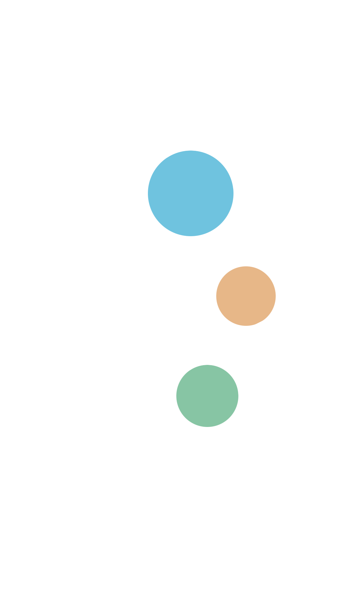

<!doctype html>

<html lang="en">

<head>

  <meta charset="utf-8">
  <title>YENNIE - Portfolio with grid and modern simplicity style</title>
  <meta name="description" content="YENNIE - Portfolio with grid and modern simplicity style">
  <meta name="viewport" content="width=device-width, initial-scale=1.0" />
  <link rel="icon" type="image/png" href="img/chibi.png" />

  <!--Style-->

  <link rel="stylesheet" href="css/reset.css">
  <link rel="stylesheet" href="css/style.css">
  <link rel="stylesheet" href="css/style-responsive.css">

  <link rel="stylesheet" href="css/font-awesome.min.css">

  <!--[if lt IE 9]>
  
  <![endif]-->

</head>

<body>

  <!--Preloader-->

  

    

      

      

    

  

  

    

      <i class="fa fa-close"></i>
    

    <ul class="menu-fullscreen">
      <li><a class="" href="index.html">Home</a></li>
      <li><a href="projects.html">Projects</a></li>
      <li><a href="about.html">About me</a></li>
      <li><a href="https://yennnie.wixsite.com/yennie">Blog</a></li>
    </ul>
  
          

  <!--Header-->
  <header class="boxed" id="header-white">

    

        
<a href="index.html">Y E N N I E.</a>

      

        <i class="fa fa-bars"></i>
      

    

    

      
<a class="" href="index.html">Y E N N I E.</a>

      <ul class="header-nav">
        <li><a class="" href="projects.html">Projects</a></li>
        <li><a class="" href="about.html">About me</a></li>
	<li><a href="https://yennnie.wixsite.com/yennie">Blog</a></li>
      </ul>

      <ul class="social-icon">
        

          <li><a href="https://www.linkedin.com/in/yennnie/"><i class="fa fa-linkedin"></i></a></li>
          <li><a href="https://www.xing.com/profile/Yen_Nguyen59/cv"><i class="fa fa-xing"></i></a></li>
          <li><a href="https://www.instagram.com/yenn.nie/?hl=en"><i class="fa fa-instagram"></i></a></li>
        

      </ul>
    

  </header>

  

  <!--Content-->

  

    

      <h1>My creative and simplicity modern</h1>
      <h1 class="typewrite">Portfolio</h1>
      
 
        Hello, I'm Yennie, A <i>Product Designer </i> and <i>Researcher </i> specializing in <i>UX/UI Design and Visual
          Design</i>.  
        I focus on creating experience that are functional and visual compelling.  Please check my portfolio. All
        project is clean and simplicity modern style.

    

    <!--Portfolio grid-->

    <ul class="portfolio-grid" id="portfolio-sidebar">

      <li class="grid-item" data-jkit="[show:delay=3000;speed=500;animation=fade]">
        
        <a href="single-gdss.html">
          

            <h1>GDSS</h1>
            
Web-Base system | UI/UX | Product

          

        </a>
      </li>

      <li class="grid-item" data-jkit="[show:delay=3000;speed=500;animation=fade]">
        
        <a href="single-jpex.html">
          

            <h1>JapanEx</h1>
            
Web | UI/UX | Front-end

          

        </a>
      </li>

      <li class="grid-item" data-jkit="[show:delay=3000;speed=500;animation=fade]">
        
        <a href="single-vlis.html">
          

            <h1>VietLIS</h1>
            
Web-based system | UI/UX| Product

          

        </a>
      </li>

      <li class="grid-item" data-jkit="[show:delay=3000;speed=500;animation=fade]">
        
        <a href="single-wood.html">
          

            <h1>Balance-Tsumiki</h1>
            
 Ecommerce Website| UI/UX

          

        </a>
      </li>

      <li class="grid-item" data-jkit="[show:delay=3000;speed=500;animation=fade]">
        
        <a href="index.html">
          

            <h1>Qsensei Log </h1>
            
Log Management System | UI | Protected 

          

        </a>
      </li>

      <li class="grid-item" data-jkit="[show:delay=3000;speed=500;animation=fade]">
        
        <a href="single-visual.html">
          

            <h1>Visual Design</h1>
            
Branding | Graphical Design

          

        </a>
      </li>

    </ul>

  

  <!--Home Sidebar-->

  

    

      

        

      

      

        

      

    

  

  <!--Footer-->

  <footer id="footer-box">

    

      
© Copyright 2020 - YENNIE. All Rights Reserved.

    

  </footer>

  <!--Scripts-->

  
  
  
  
  
  
  
  

  
	

</body>

</html>
